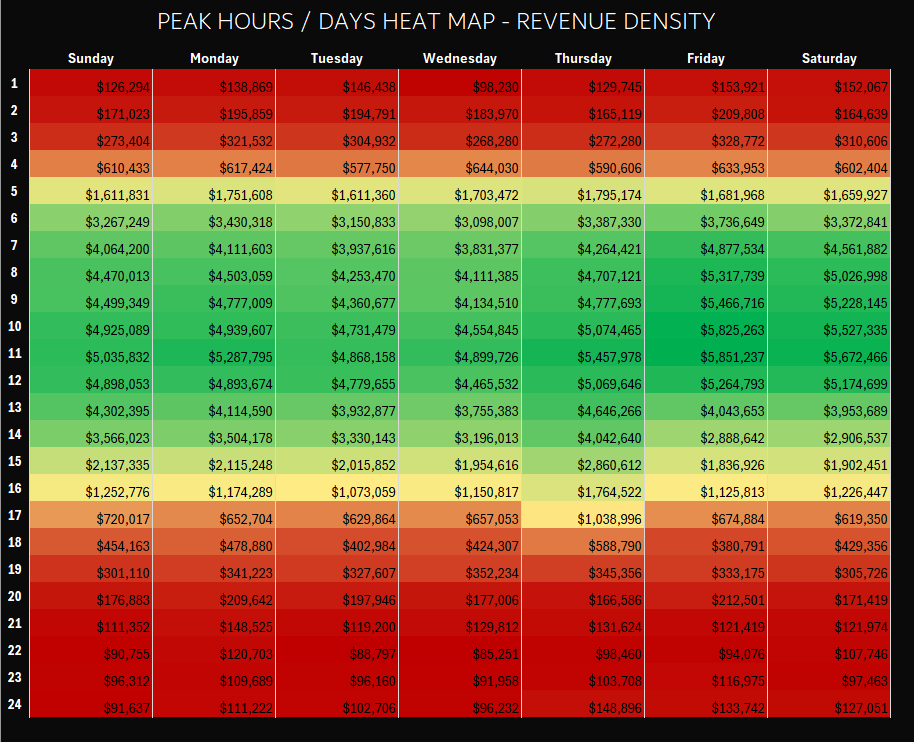

# E-Commerce Behavioral & Sales Performance Dashboard

### ⚠️ Important Notice Regarding the Data File

Due to GitHub file size limits, the raw dataset (`RawData.csv`) which is around 300MB could not be uploaded with the project files.
To run this project correctly on your machine, please follow these steps:
1. Download the data file directly from Google Drive [by clicking here](https://drive.google.com/file/d/1-MrmZYw3Cii04jcRqebvvHsUAkzy5SIe/view?usp=drive_link).
2. Move the downloaded file into the `Resources > Data` folder.
3. Make sure the file is named exactly as: `RawData.csv` (case-sensitive, with no extra characters).

### 🔄 How to Connect the Data and Refresh
Once you have placed the `RawData.csv` file in the `Resources > Data` folder, you need to tell Excel where to find it on your machine:

1. Open the Excel file (`E-Commerce Behavioral & Sales Performance Dashboard.xlsx`).
2. Go to the **Data** tab in the top ribbon, then click on **Queries & Connections**.
3. On the right side, double-click on the main query named **Data** to open the Power Query Editor.
4. In the Power Query menu, go to **Home** -> **Data Source Settings**.
5. Click on **Change Source**, then browse and select the folder where you saved the dataset on your local device.
6. Click **OK**, then press **Close & Apply** (top left corner) to let Excel load the 2.6M+ rows.

--------------------

**The Problem:**
Managing a raw dataset of over **2.6 Million rows** goes far beyond standard spreadsheet capabilities and creates severe performance bottlenecks:
* **Scale Issue:** Ingesting 2.6M+ transactional records crashes standard Excel and overwhelms Power Query/Power Pivot if not optimized.
* **Severe Data Quality Issues:** The raw data was highly unpolished and "dirty". It contained massive volumes of missing values (nulls/blanks) and structural inconsistencies, making it completely unsuitable for direct analysis without extensive pre-processing.
* **Latency:** Heavy cell formulas or unoptimized data structures cause long rendering delays, making dynamic analysis impossible.
* **Objective:** Clean the messy records and build a responsive, stable operational dashboard that extracts actual business value.

**The Solution:**
To handle this scale and data complexity efficiently within Excel, I treated the environment like a data warehouse:
* **Intensive ETL (Data Cleansing):** Utilized Power Query to handle the massive gaps of null values, filter out corrupted records, and standardize column types to ensure analytical integrity.
* **Data Modeling:** Built a structured **Star Schema** (Fact and Dimension tables) inside Power Pivot to eliminate data redundancy.
* **Calculation Layer:** Replaced slow cell-based formulas with optimized **DAX measures** driven by Boolean filter logic to minimize memory usage.
* **UI Stability:** Fixed Pivot Table grid settings (`Show empty items` & `Fixed Column Widths`) to prevent layout collapse during filtering.
* **Performance:** Achieved a stable dashboard where slicers cross-filter the 2.6M+ records with a response latency of **under 3 seconds**.
--------------
## Step 1: Power Query & Data Pipeline

I used Power Query to build an automated cleaning pipeline for the 2.6M+ rows. Because Excel has strict memory limits, the order of these steps was critical to prevent the system from crashing.

### 1. Connecting to the Data Folder
* **What I did:** Instead of importing a single static file, I used the **Folder Connector** to link Excel to the data directory.
* **Why:** This makes the pipeline fully automated. If a new data file is dropped into the folder, Excel will ingest, combine, and clean it automatically without breaking. I also filtered out hidden files to prevent system errors.

### 2. Splitting Date and Time (Cardinality Reduction)
* **What I did:** I split the `event_time` column into two separate columns: `event_date` and `event_time`. I also filtered out any corrupted rows containing the default date `1970-01-01`.
* **Why:** A combined date-time column creates millions of unique records (**high cardinality**), which slows down Excel's compression engine. Splitting them makes the file size much smaller and prepares the date column to link perfectly with a Calendar table later.

### 3. Early Deduplication
* **What I did:** I ran the `Table.Distinct` step early in the process, right after splitting the columns and before doing heavy text cleaning.
* **Why:** Removing duplicate rows as early as possible drops the total row count immediately, which speeds up all the text transformations that follow.

### 4. Text Cleaning and Standardization
* **What I did:** I applied `Trim`, `Clean`, and `Proper Case` to the categorical text columns like `brand` and `category_code`.
* **Why:** This removes hidden spaces and weird symbols from web scraping. It also standardizes the text so variations like "samsung" and "Samsung" are grouped together as one single brand.

### 5. Smart Null Handling
* **What I did:** For text and category columns, I replaced blanks and nulls with the text `"MissingInfo"`. I deliberately left numerical columns (`Price`) and time columns as blank/null.
* **Why:** Putting "MissingInfo" makes it easy to track missing data in slicers. However, putting fake zeros or placeholder dates in numerical columns would ruin the accuracy of DAX averages and totals, so those were kept blank.

### 6. Securing IDs and Fixing Key Integrity
* **What I did:** I added an `id-` prefix to all ID columns (`order_id`, `product_id`, etc.) to force Excel to treat them strictly as text, preventing accidental auto-summing. 
* **Why I fixed it at the end:** Adding the prefix after null handling created a small bug where blanks became `"id-MissingInfo"`. I added a final step to replace `"id-MissingInfo"` back to a clean `"MissingInfo"`, keeping the keys accurate and clean.

### Complete Power Query M Code
```powerquery
let
    source = Folder.Files("C:\Projects\E-Commerce Behavioral & Sales Performance Dashboard\E-Commerce Behavioral & Sales Performance Dashboard\Resources\Data"),
    #"Filtered Hidden Files1" = Table.SelectRows(source, each [Attributes]?[Hidden]? <> true),
    #"Invoke Custom Function1" = Table.AddColumn(#"Filtered Hidden Files1", "Transform File", each #"Transform File"([Content])),
    #"Renamed Columns1" = Table.RenameColumns(#"Invoke Custom Function1", {"Name", "Source.Name"}),
    #"Removed Other Columns1" = Table.SelectColumns(#"Renamed Columns1", { "Transform File"}),
    #"Expanded Table Column1" = Table.ExpandTableColumn(#"Removed Other Columns1", "Transform File", Table.ColumnNames(#"Transform File"(#"Sample File"))),
    #"Change type (defult steps)" = Table.TransformColumnTypes(#"Expanded Table Column1",{{"event_time", type text}, {"order_id", Int64.Type}, {"product_id", Int64.Type}, {"category_id", Int64.Type}, {"category_code", type text}, {"brand", type text}, {"price", type number}, {"user_id", Int64.Type}}),
    #"event column split" = Table.SplitColumn(#"Change type (defult steps)", "event_time", Splitter.SplitTextByDelimiter(" ", QuoteStyle.Csv), {"event_date", "event_time"}),
    #"Reordered Columns" = Table.ReorderColumns(#"event column split",{"order_id", "product_id", "category_id", "user_id", "category_code", "brand", "event_date", "event_time", "price"}),
    #"Changed Type" = Table.TransformColumnTypes(#"Reordered Columns",{{"order_id", type text}, {"product_id", type text}, {"category_id", type text}, {"user_id", type text}, {"category_code", type text}, {"brand", type text}, {"event_date", type date}, {"event_time", type time}, {"price", type number}}),
    #"Filtered Rows" = Table.SelectRows(#"Changed Type", each ([event_date] <> #date(1970, 1, 1))),
    #"Removed Duplicates" = Table.Distinct(#"Filtered Rows"),
    #"Trimmed Text" = Table.TransformColumns(#"Removed Duplicates",{{"order_id", Text.Trim, type text}, {"product_id", Text.Trim, type text}, {"category_id", Text.Trim, type text}, {"user_id", Text.Trim, type text}, {"category_code", Text.Trim, type text}, {"brand", Text.Trim, type text}}),
    #"Cleaned Text" = Table.TransformColumns(#"Trimmed Text",{{"order_id", Text.Clean, type text}, {"product_id", Text.Clean, type text}, {"category_id", Text.Clean, type text}, {"user_id", Text.Clean, type text}, {"category_code", Text.Clean, type text}, {"brand", Text.Clean, type text}}),
    #"Capitalized Each Word" = Table.TransformColumns(#"Cleaned Text",{{"order_id", Text.Proper, type text}, {"product_id", Text.Proper, type text}, {"category_id", Text.Proper, type text}, {"user_id", Text.Proper, type text}, {"category_code", Text.Proper, type text}, {"brand", Text.Proper, type text}}),
    #"Remove blanks" = Table.ReplaceValue(#"Capitalized Each Word","","MissingInfo",Replacer.ReplaceValue,{"order_id", "product_id", "category_id", "user_id", "category_code", "brand"}),
    #"Remove Nulls" = Table.ReplaceValue(#"Remove blanks",null,"MissingInfo",Replacer.ReplaceValue,{"order_id", "product_id", "category_id", "user_id", "category_code", "brand"}),
    #"Added Prefix" = Table.TransformColumns(#"Remove Nulls", {{"order_id", each "id-" & _, type text}}),
    #"Added Prefix1" = Table.TransformColumns(#"Added Prefix", {{"product_id", each "id-" & _, type text}}),
    #"Added Prefix2" = Table.TransformColumns(#"Added Prefix1", {{"category_id", each "id-" & _, type text}}),
    #"Added Prefix3" = Table.TransformColumns(#"Added Prefix2", {{"user_id", each "id-" & _, type text}}),
    #"Replaced Value" = Table.ReplaceValue(#"Added Prefix3","id-MissingInfo","MissingInfo",Replacer.ReplaceText,{"order_id", "product_id", "category_id", "user_id"})
in
    #"Replaced Value
```
-----------
##  Step 2: Data Modeling (Power Pivot & Star Schema)

### 1. Why a Star Schema?
Instead of dumping all 2.6M+ rows into one giant, messy sheet (a flat table), I built a **Star Schema** inside Power Pivot. Keeping everything in a single table would crash Excel instantly. By breaking the data down into a central Fact table and smaller Dimension tables, I stopped the system from wasting memory by repeating long text strings millions of times.

### 2. How I Split the Tables (Power Query References)
Using the clean master query as my source, I used the **Reference** feature to create three distinct tables:

* **Dim_Products (The Product Catalog):**
  * **What it does:** Acts as a unique dictionary for products and their fixed features.
  * **Columns kept:** `product_id`, `category_id`, `category_code`, and `brand`.
  * **How I built it:** I selected `product_id` and used **Remove Duplicates** to make it a clean Primary Key. This dropped the text rows from 2.6 million down to about 23,000 unique products, compressing the file size massively.
* **Fact_Sales (The Core Event Log):**
  * **What it does:** Stores the actual transactional events and financial metrics.
  * **Columns kept:** `order_id`, `product_id`, `user_id`, `event_date`, `event_time`, and `price`.
  * **How I built it:** I completely removed all descriptive text columns (like brand and category names) to keep this massive table as "skinny" as possible, relying on numbers and index keys instead of text strings.
* **Dim_Date (The Calendar Table):**
  * **What it does:** A continuous chronological date table with columns for Year, Quarter, Month, and Day. This is required to make advanced DAX time-intelligence functions work accurately.

### 3. Setting Up the Relationships
I connected the tables in Power Pivot using strict **1-to-Many** relationships so the filters flow in a single, predictable direction:
* Connected `product_id` from `Dim_Products` to `Fact_Sales`.
* Connected `event_date` from `Dim_Date` to `Fact_Sales`.

This direct mapping prevents data distortion and stops Excel from locking up when multiple products are analyzed under the same `order_id`.

### 4. Why this Layout Makes the Dashboard Fast
Structuring the model this way gave me huge performance benefits:
* **Better Memory Compression:** Separating text into `Dim_Products` allows Excel’s **VertiPaq engine** to use dictionary encoding efficiently. This stops the RAM from overloading and makes dynamic calculations way faster.
* **No Update Anomalies:** This setup enforces a single version of the truth. If a brand or category name changes in the future, it only needs to be updated in one row inside the product table, and it instantly reflects across all 2.6M+ records.
* **Ready for Scale:** The model is now ready to handle new data (like returns or inventory tables) by simply linking them to the existing dimensions without rebuilding the whole system from scratch.


---------------------
## Step 3: Dashboard Structure & Analytical Hubs

To keep the user interface clean and prevent crowding the screen with too much data at once, I divided the dashboard into **4 distinct analytical pages (Hubs)**. Each page is designed to isolate and study a specific angle of the e-commerce business, turning the 2.6M+ rows into clear, structured insights without overwhelming the end-user.

### Hub 1: Financial Overview

This page is the core financial health monitor of the e-commerce operation. Management speaks the language of money, so this section focuses entirely on tracking revenue streams, sales volumes, and identifying the top-performing commercial segments.

#### Core KPI Cards
* **Total Revenue ($336,963,381):** Tracks the total gross inflows to monitor the overall scale of the business.
* **Total Units Sold (2,613,215):** Measures the absolute volume of products moved through the platform.
* **Total Orders (1,426,253):** Counts the total successful transaction cycles processed.
* **Average Order Value - AOV ($236):** Shows the average amount spent per transaction, which is critical for evaluating pricing power and customer spending habits.


#### Visualizations & Insights
* **Top 10 Brands (Column Chart):** Ranks the top 10 brands generating the highest total revenue, showing which suppliers drive the most financial value.

* **Top 10 Categories (Bar Chart):** A horizontal bar chart ranking the highest-grossing product categories, giving a clean look at inventory performance.

* **Revenue Trend Over Months (Line Chart):** Maps the relationship between months and incoming revenue to visually spot seasonal trends, growth spurts, or dips over time.


#### Interactivity & Filters
The entire financial view changes dynamically based on two interactive slicers:
1. **Month Slicer:** Allows stakeholders to drill down into specific months to analyze seasonal performance.
2. **Category Slicer:** Filters the entire page by specific product types to see how individual categories impact overall brand revenue and monthly trends.

----------------------
### Hub 2: Customer Behavior

This section tracks unique user metrics and transaction habits to understand customer loyalty and platform friction.


#### Core KPI Cards
* **Total Unique Customers (233,576):** Total count of distinct user IDs across the dataset.
* **Purchase Frequency (6.11):** Average number of orders placed per unique customer.
* **Guest Checkout Rate % (73.5%):** Percentage of total orders completed by unregistered users.


#### Visualizations
* **Registered vs. Guest Users (Pie Chart):** Compares account checkouts against guest checkouts. The high guest rate shows a strong preference for fast, friction-free purchasing.

* **Top 10 Customers (Table/Matrix):** Lists the highest-spending user IDs for targeted retention.


#### Interactivity
Controlled by the Month and Category slicers to monitor changes in loyalty habits across different periods and product types.
---------------
### Hub 3: Product Intelligence

This section analyzes inventory performance, product distribution, and the relationship between pricing and sales volume.


#### Core KPI Cards
* **Top Category:** The highest-performing category by order volume.
* **Top Brand:** The brand driving the most transaction volume.
* **Average Item Price:** The mean price point of products sold across the platform.


#### Visualizations
* **Price vs. Volume Correlation (Scatter Plot):** Maps individual product prices against total quantities sold. This chart highlights price elasticity and shows the volume density of items at different price tiers.
* 


* **Top 50 Categories (Treemap):** Displays the largest 50 categories based on item count, providing a visual breakdown of product assortment density.
* **Top 10 Brands by Unit Volume (Chart):** Ranks the top 10 brands based strictly on the total quantity of units sold, identifying volume-driven suppliers.


#### Interactivity
Controlled by the Month and Category slicers to allow drill-downs into specific timeframes and product groups.

-------------------

### Hub 4: Temporal Analytics

This section tracks time-based patterns, sales density, and seasonal trends across different periods using time-intelligence metrics.

#### Core KPI Cards
* **Peak Hour Daily (10:00):** The specific hour that records the highest volume of transactions and user activity.
* **Busiest Month (Sep):** The month with the highest operational transaction density.
* **Busiest Day (7):** The day index representing the peak transaction volume of the week.


#### Visualizations
* **Peak Hours / Days Heat Map - Revenue Density:** A 24x7 matrix cross-referencing hours of the day against days of the week. The highest revenue density (green cells) is strictly concentrated between 08:00 and 13:00, peaking heavily at 10:00 and 11:00, particularly on Fridays and Saturdays. The lowest density (red cells) occurs late at night between 20:00 and 04:00.
  
* **Sales by Day of Week (Column Chart):** Compares total revenue across the week. Thursday leads with the highest revenue (~$51.6M), followed closely by Friday (~$51.3M), while Wednesday represents the lowest point in weekly sales (~$44.1M).
* **Monthly Revenue & Growth Trends (Combo Chart):** Tracks revenue performance across months alongside Month-over-Month (MoM) growth velocity. August records the highest total revenue (~$53M), while May shows the sharpest spike in growth rate acceleration.

----------------------------------

## Conclusion & Future Growth

This repository marks the second milestone in my data analysis learning journey. I acknowledge that the pipeline, model, or visuals may still contain mistakes or areas that require deeper optimization. 

I treat these gaps as essential learning experiences rather than flaws. As my technical skills develop and my engineering mindset matures, I look forward to revisiting this project to refine the logic and apply more advanced data warehouse practices.
